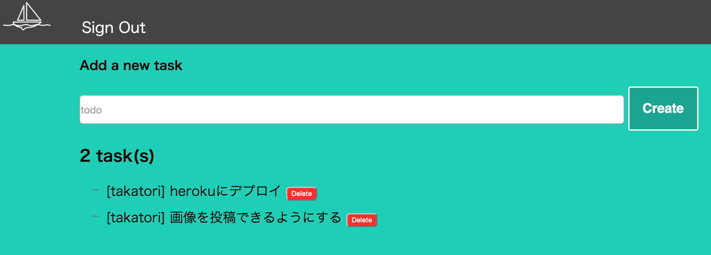

# todolist

[](https://circleci.com/gh/takatori-task/todolist)


## Description
ScalaとPlayframework練習用アプリケーション
Github認証によるログインが可能

***DEMO:***
- [heroku](https://takatori-todolist.herokuapp.com/)


## Requirement
- Scala 2.11
- Play 2.4
- postgresql 9.4


## Installation(Mac)
### postgresql起動
```
$ postgres -D /usr/local/var/postgres
```

### database作成
```
$ createdb todolist
```

### リポジトリのクローン
```
$ git clone https://github.com/takatori-task/todolist.git
$ cd todolist
```

### コンパイル
```
$ sbt compile
```

### 実行
```
$ sbt run
```
localhost:9000にアクセス

### テスト実行
```
$ sbt test
```


## Author

[takatori](https://github.com/takatori)

